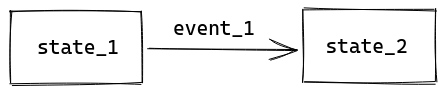
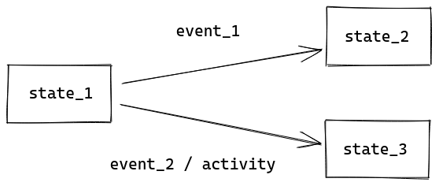
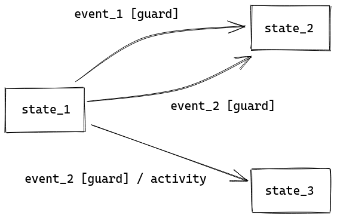
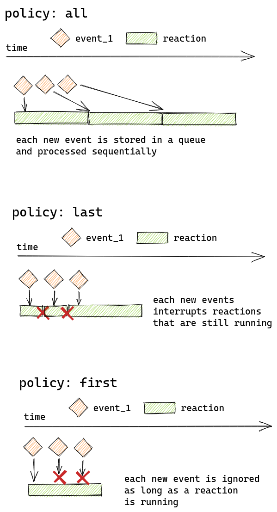

<h1>redux sigma </h1>


`redux-sigma` is a library that allows implementation of state machines on top
of `redux` and `redux-saga`.

State machines implemented with `redux-sigma` react to events dispatched via `redux`,
and their state can be stored inside `redux` using a dedicated reducer.

The aim of `redux-sigma` is providing developers with a formal framework
that can be used when dealing with complex business flows inside front-end applications.

Being based on `redux-saga`, `redux-sigma` expects all your redux actions to follow
the [FSA](https://github.com/redux-utilities/flux-standard-action) pattern.

`redux-sigma` has extensive TypeScript support, and we recommend using it with TypeScript.

## Installation

```bash
$ yarn add redux-sigma
```

or

```bash
$ npm install redux-sigma
```

`redux-sigma` has `redux` and `redux-saga` as peer dependencies.

## Basic usage

State machines in `redux-sigma` must extend a generic `StateMachine` class.

The simplest way to define a state machine is to extend the `StateMachine` class,
and to define its abstract fields:

```typescript
import { StateMachine } from 'redux-sigma';

class MyStateMachine extends StateMachine {
  initialState = 'first_state';

  name = 'my_state_machine';

  spec = {
    first_state: {
      transitions: {
        first_event: 'second_state',
      },
    },
    second_state: {
      transitions: {
        second_event: 'first_state',
      },
    },
  };
}
```

The `spec` field is the actual _specification_ of the state machine:
an high level description of what its states are, and how the state machines
goes from one state to another.
More on this [later](#state-machines-specification).

The `initialState` field indicates what will be the state of the state machine
when it first starts.

The `name` field is what identifies state machines: for `redux-sigma`,
two state machines cannot have the same name.

To use a state machine, you first need to instantiate it:

```typescript
export const myStateMachine = new MyStateMachine();
```

Then, you must connect your state machine to `redux` via `redux-saga`.

`redux-sigma` provides a `stateMachineStarterSaga` utility to coordinate state machines startup
that integrates with your `redux` store and your `redux-saga` middleware.

```typescript
import { createStore, applyMiddleware } from 'redux';
import { createSagaMiddleware } from 'redux-saga';
import { stateMachineStarterSaga } from 'redux-sigma';
import { rootReducer } from './root-reducer';
import { myStateMachine } from './my-state-machine';

const sagaMiddleware = createSagaMiddleware();

const store = createStore(rootReducer, applyMiddleware(sagaMiddleware));

sagaMiddleware.run(stateMachineStarterSaga, myStateMachine);
```

State machines can be started and stopped by dispatching actions to `redux`:

```typescript
store.dispatch(myStateMachine.start({}));

store.dispatch(myStateMachine.stop());
```

Multiple `start` actions dispatched one after another have no effect on the state machine:
the state machine is started only once.
The same is true for `stop` actions.
To restart a running state machine, dispatch a `stop` action followed by a `start` action.

To have the state of your state machines available inside your `redux` store,
use the `stateReducer` of the state machine:

```typescript
import { combineReducers } from 'redux';
import { myStateMachine } from './my-state-machine';

const rootReducer = combineReducers({
  my_state_machine: myStateMachine.stateReducer,
});
```

While the state machine is not running, its state will look like this:

```typescript
console.log(store.getState().my_state_machine);
// { state: null }
```

Once the state machine starts running, its state will look like this:

```typescript
console.log(store.getState().my_state_machine);
// { state: 'first_state', context: {} }
```

The state and the context of the state machines will be updated independently
during the state machine lifetime, according to its specification.

## Using generics

The `StateMachine` class is generic, and the recommended usage is to rely on those generics.

The generics allow you to restrict the possible values of:

- the events that the state machine reacts to
- the states that the state machine can be in
- the names of all your state machines (to avoid conflicts)
- the context (or extended state) of the state machine

Generics are specified in this order:

```typescript
class MyStateMachine extends StateMachine<Events, States, StateMachineNames, Context> {
  /* ... */
}
```

The `Events`, `States`, and `StateMachineNames` generics must all be string-like.
The `Context` must be an object.

- The `Events` generic restricts what action types can be used as keys
in the `transitions` and `reactions` section of the specification.
- The `States` generic determines what states must be used as keys in the specification.
- The `StateMachineNames` generic restricts what value can be assigned to the `name` of the state machine.
- For more details on `Context`, see [later](#context-or-extended-state).

By default, the state machine can have any string as `Events`, `States`, and `StateMachineNames`.
The `Context` defaults to an empty object.

Our preferred approach is to use TypeScript `enum`s to define `Events`, `States`, and `StateMachineNames`:

```typescript
enum Events {
  event_1 = 'first event',
  event_2 = 'second event',
}

enum States {
  state_1 = 'first state',
  state_2 = 'second state',
}

enum StateMachineNames {
  my_state_machine = 'my state machine',
}
```

You can use a single `Events` enum for all your state machines,
or divide your events in multiple enums, possibly combining them in a single state machine.

Each state machine should have its own `States` enum.
It's still possible to reuse a single `States` enum across multiple state machines.

There should be a single `StateMachineNames` enum in your application.

When relying on generics and on TypeScript, your state machines will look like this:

```typescript
class MyStateMachine extends StateMachine<Events, States, StateMachineNames> {
  protected readonly initialState = States.state_1;

  readonly name = StateMachineNames.my_state_machine;

  protected readonly spec = {
    [States.state_1]: {
      transitions: {
        [Events.event_1]: States.state_2,
      },
    },
    [States.state_2]: {
      transitions: {
        [Events.event_2]: States.state_1,
      },
    },
  };
}
```

## Activities

The state machines in `redux-sigma` can perform actions based on their state
and on the events they receive.

Actions or activities are defined using simple functions or using sagas.

In the majority of cases, you will need only the following `redux-saga` effects:

- `call`, to call remote endpoints or other services
- `select`, to read data from the `redux` store
- `put`, to send events to other state machines or actions to `redux` reducers
- `delay`, to delay the execution of successive actions

## `context` or extended state

Relying only on the states to implement your flows cannot be enough for complex flows.
State machines allow you to define an _extended state_, or _context_ of your state machine,
that can hold additional information for each state.

A simple example would be a state machine containing a counter:
modeling each possible value of the counter as a different state is an anti-pattern.
The value of the counter is an example of something that can be stored in the extended state.

Each state machine implemented with `redux-sigma` has a context available in its activities.

```typescript
class MyStateMachine extends StateMachine {
  *activity() {
    // values can be retrieved from the context
    const counter = this.context.counter;
    // the context is immutable: to update it, use the setContext method
    // the setContext accepts an immer-style callback...
    yield* this.setContext(ctx => {
      ctx.counter += 1;
    });
    // ...or a new value for the whole context
    yield* this.setContext({
      counter: 5,
    });
  }
}
```

To change the context, use the [`yield*` generator delegation expression](https://developer.mozilla.org/en-US/docs/Web/JavaScript/Reference/Operators/yield*)
in combination with the `setContext` method.

The `setContext` method allows you to override the whole context with a new value,
or to use an [`immer`-style callback](https://immerjs.github.io/immer/docs/produce) to mutate the context.

The context is immutable: you must always use the `setContext` method to update it.
Updating the context via `setContext` updates its value stored inside `redux`.

Context is available in all activities and in transition guards.
Transition guards cannot mutate the context.

### Initial context

If a state machine requires some information in its context on start,
you can make that field required in the context definition:

```typescript
interface Context {
  counter: number;
}

class MyStateMachine extends StateMachine<Events, States, StateMachineNames, Context> {
  /* ... */
}
```

To start this state machine you are now required to provide an initial context:

```typescript
store.dispatch(myStateMachine.start({ counter: 0 }));
```

If the context of your state machine is filled during the state machine lifecycle,
and there is no reasonable value for the initial context, then make all fields optional:

```typescript
interface Context {
  counter?: number;
}

class MyStateMachine extends StateMachine<Events, States, StateMachineNames, Context> {
  /* ... */
}
```

Now you are not required to provide an initial context (but you still can):

```typescript
// this works
store.dispatch(myStateMachine.start({}));
// this works too
store.dispatch(myStateMachine.start({ counter: 5 }));
```

## State machines specification

The `spec` field of each state machine is an object.
Its keys represent the state names (or identifiers) of your state machine:

```typescript
class MyStateMachine extends StateMachine {
  spec = {
    state_1: { /* definition of state 1 */ },
    state_2: { /* definition of state 2 */ },
    state_3: { /* definition of state 3 */ },
  };
}
```

Each state definition can contain several fields:

```typescript
class MyStateMachine extends StateMachine {
  spec = {
    state_1: {
      onEntry: [ /* activities that will run upon entering the state */ ],
      subMachines: [ /* other state machines that will run while in this state */ ],
      transitions: { /* transition definition */ },
      reactions: { /* reactions (or internal transitions) definition */ },
      onExit: [ /* activities that will run upon exiting the state */ ],
    },
  };
}
```

All fields are optional, and are described in the detail in the following sections.

### `transitions`

Transitions are the core of all state machines: they define how the state of the state machine
evolves in response to events that happen in your application.

The `transitions` field is an object mapping events (which are the `type` of your `redux` actions)
to the state that your state machine will reach upon receiving that event.

```typescript
class MyStateMachine extends StateMachine {
  spec = {
    state_1: {
      transitions: {
        event_1: 'state_2',
      },
    },
    state_2: { /* ... */ },
  };
}
```

Simple transitions can be illustrated as follows:



The transition from `state_1` to `state_2` will be triggered by any `redux` action
having a `type` equal to `'event_1'`:

```typescript
// this action would trigger the transition
store.dispatch({ type: 'event_1' });

// this action would trigger the transition too
store.dispatch({ type: 'event_1', payload: { value: 'something something'} });
```

#### Running activities on transition

Sometimes you may want to perform an activity when doing a specific transition.
`redux-sigma` allows you to specify the activity that must be performed on a given transition:

```typescript
class MyStateMachine extends StateMachine {
  spec = {
    state_1: {
      transitions: {
        event_1: 'state_2',
        event_2: {
          target: 'state_3',
          command: this.transitionActivity,
        },
      },
    },
    state_2: { /* ... */ },
    state_3: { /* ... */ },
  };

  *transitionActivity(event) {
    // do something with `event`
  }
}
```

Transitions paired with commands can be represented in this way:



The `target` in the `event_2` transition identifies the state that your state machine will reach
after executing the `command`.

Commands can be regular functions or generators (sagas), or an array of both.
They receive in input the event that triggered the transition.
There is no guarantee on the order in which commands are executed when performing the transition,
but all commands will execute to completion before entering the `target` state.

#### Conditional transitions: `guard`s

For more advanced use-cases, you may want to perform a transition when receiving an event
but _only_ if some conditions are met.
This is know as a **guard** in UML State Machines and StateCharts.

Guards can be implemented in `redux-sigma` with this syntax:

```typescript
class MyStateMachine extends StateMachine {
  spec = {
    state_1: {
      transitions: {
        /* this transition is triggered only if the guard returns true */
        event_1: {
          guard: (event, context) => { /* ... */ },
          target: 'state_2',
        },
        /* this event can take the state machines to several states:
           only the transition for which the guard returns true is triggered */
        event_2: [
          {
            guard: (event, context) => { /* ... */ },
            target: 'state_2',
          },
          {
            guard: (event, context) => { /* ... */ },
            target: 'state_3',
            command: this.transitionActivity,
          },
        ],
      },
    },
    state_2: { /* ... */ },
    state_3: { /* ... */ },
  };
}
```

Guarded transitions are represented with the guard condition between square brackets:



For `event_1`, the transition will be triggered only if the `guard` function returns `true`,
otherwise nothing will happen.

For `event_2`, we have defined an array of possible transitions:
the only transition that will be triggered is the one for which the `guard` function returns `true`.

There is no guarantee on the order in which `guard`s are executed:
it's up to you to make sure that at most one `guard` returns `true` for any given input.

Note that the `event_2` transition to `state_3` contains a command:
this command will run if that specific transition is triggered.

All `guard`s receive in input the event that could trigger the transition,
and the current `context` of the state machine.
You can learn more about the context in its [section](#context-or-extended-state).

### `reactions` or internal transitions

Sometimes you want your state machine to perform some action in response to an event
_without_ changing the state.
In `redux-sigma` this is possible via _reactions_ or internal transitions.

The `reactions` are defined as a map between event types and functions or generators (saga).
Reaction activities will receive in input the event that triggered the transition.

```typescript
class MyStateMachine {
  spec = {
    state_1: {
      reactions: {
        event_1: this.reaction,
      },
    },
  };

  *reaction(event) {
    // use the triggering event in your reaction
  }
}
```

By default, while the state machine is in `state_1`, each action of type `event_1`
dispatched to the `redux` store will trigger the reaction.
If several events that trigger a reaction are dispatched one after another,
one call to the reaction will be enqueued for each event.
Each call waits for the previous calls to complete before running.

You may find yourself needing a different behaviour than the default.
`redux-sigma` allows three different reaction policies:

- the reaction policy `all` (the default) processes all events that can trigger
  a reaction sequentially, in the order they are received
- the reaction policy `first` processes the first event it receives, and ignores
  the same event until processing of the first event is complete
  (processing is resumed once the first event completes)
- the reaction policy `last` processes all events it receives, but if a new event
  is receive while another event is processing, the reaction that started first
  is stopped, and a new reaction is started for the new event

This image illustrates the three policies:



Reaction policies can be specified in the following way:

```typescript
import { StateMachine, all, first, last } from 'redux-sigma';

class MyStateMachine extends StateMachine {
  spec = {
    state_1: {
      reactions: {
        event_1: all(this.reaction),
        event_2: first(this.reaction),
        event_3: last(this.reaction),
      },
    },
  };
}
```

### `onEntry` and `onExit` activities

The `onEntry` and `onExit` fields are an array that mixes functions and generators (sagas).
They receive nothing in input and must not return anything.
Both arrays can contain methods of the state machine class.

If your state has only one `onEntry` or one `onExit`, you can use this short-hand syntax:

```typescript
class MyStateMachine extends StateMachine {
  spec = {
    state_1: {
      onEntry: this.onEntry,
      onExit: this.onExit,
    },
  };
}
```

The `onEntry` activities will start running as soon as your state machine enters the state.
While `onEntry` activities are running, the state machine can change state if it receives
one of the events described among its `transitions`.
If a transition happens, `onEntry` activities will be stopped
(using the [`cancel`](https://redux-saga.js.org/docs/api/#canceltask) effect of `redux-saga`).

The `onExit` activities will run when your state machine exits the state,
or when your state machine is stopped while in that specific state.
They always run to completion before exiting the state.

There is no guarantee about the order in which `onEntry` and `onExit` activities are run
inside a state.

### Sub state machines

In state machine, each state represents a configuration of your application in which an invariant is holding.
Sometimes a single state can be subdivided into additional states, or configurations.
To accomplish this we rely on _sub state machines_.

```typescript
import { mySubStateMachine } from './my-sub-state-machine';

class MyStateMachine extends StateMachine {
  spec = {
    state_1: {
      subMachines: [mySubStateMachine],
    },
  };
}
```

To add a sub state machine to a state, define the sub state machine
and add its instance to the `subMachines` field of the parent state machine.

This syntax only works with sub state machines that use the default context,
or that have no required fields in their context.

If your sub state machine requires some info in the initial context (see the [context section](#initial-context)),
you must build the initial context from the context of the parent state machine,
and bind it to the sub state machine:

```typescript
import { StateMachine, bindStm } from 'redux-sigma';
import { mySubStateMachine } from './my-sub-state-machine';

class MyStateMachine extends StateMachine {
  spec = {
    state_1: {
      subMachines: [bindStm(mySubStateMachine, this.buildContext)],
    },
  };

  buildContext() {
    // you can access the context of MyStateMachine from here
    return {
      counter: 5,
    };
  };
}
```

---

developed with :heart: by [moveax](https://moveax.it/)
