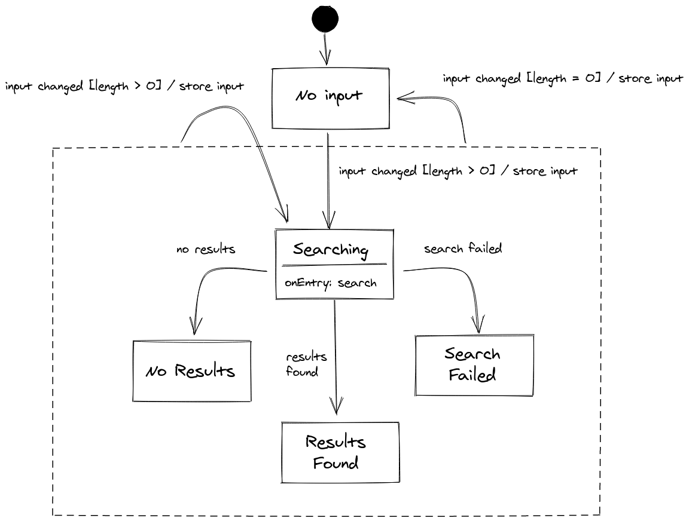

# Search example

This folder contains an example taken from our talk at the
[**Codemotion Online Tech Conference 2020 - Italian edition**](https://events.codemotion.com/conferences/online/2020/online-tech-conference-italian-edition#home).

The example implements this state machine:



There are two implementations in this folder:

- a "light" TypeScript implementation, that does not rely too heavily on generics
- a full TypeScript implementation, that adds a lot of types annotation

The example shows the following features of `redux-sigma`:

- guarded transitions
- `onEntry` activities
- commands on transitions
- usage of the context

You can run both examples using `ts-node`:

```bash
$ yarn run ts-node ./examples/full-typescrpit.ts
```
